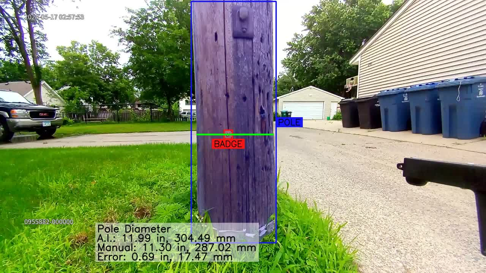
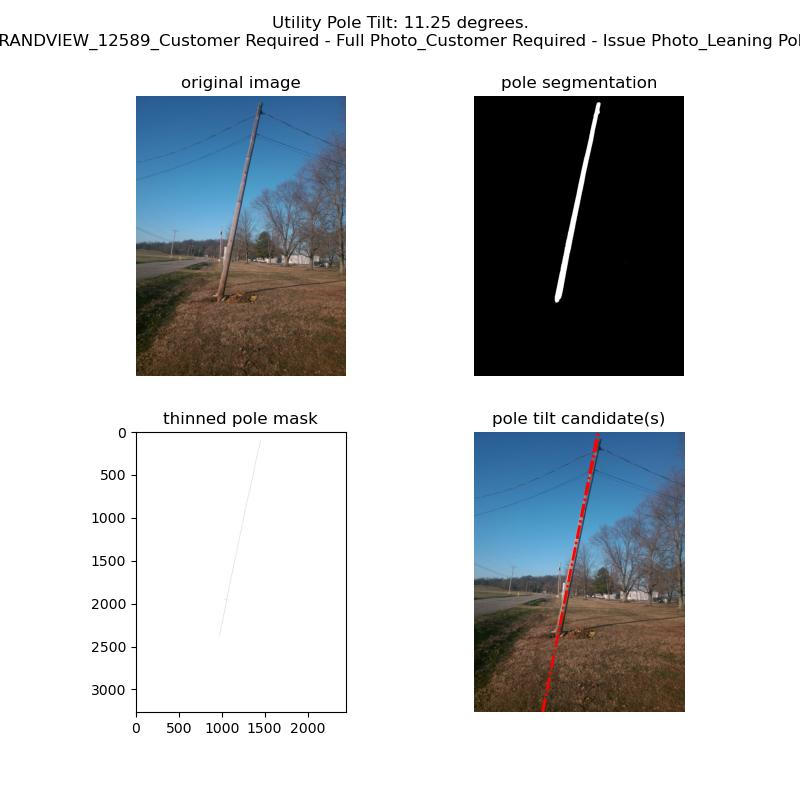
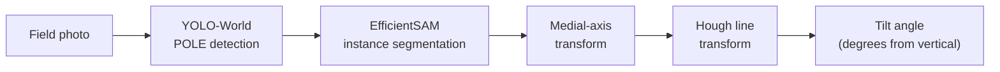

# Utility Pole AI Photogrammetry

> Computer-vision pipeline for **non-contact measurement** of utility pole geometry:
> diameter from walking video and tilt angle from field images.

[](https://python.org)
[](https://pytorch.org)
[](LICENSE)

---

## Overview

Traditional utility pole inspection requires physical contact with specialised
calipers or laser rangefinders.  This project replaces those methods with an
AI photogrammetry pipeline operating on standard smartphone video and field
photographs — no special hardware needed.

Two independent measurement capabilities:

| Capability | Input | Output |
|---|---|---|
| **Pole diameter** | Walking video (smartphone) | Diameter in inches & mm, per-frame annotated video |
| **Pole tilt angle** | Single field photograph | Tilt in degrees from vertical, annotated image + methodology figure |

---

## Pole Width / Diameter Estimation

### Demo


*Real-time diameter estimation from a smartphone walking video.
Blue overlay = pole mask · Red overlay = inspection badge (1.25 in reference)
Green line = measured diameter at badge height.*

### Sample annotated frame



### Algorithm


1. **Reference-object detection** — YOLO-World detects `POLE` and `BADGE` (a
   1.25-inch inspection badge affixed before filming) simultaneously.
2. **False-positive pruning** — heuristics filter by aspect ratio, area bounds
   (4–75 % of frame), and spatial containment of badge within the pole box.
3. **Pixel-accurate segmentation** — EfficientSAM masks the pole; the mask is
   sliced at the badge midpoint to measure the true cross-sectional width.
4. **Depth-calibrated scaling** — a scaling factor of `1.32` converts the pixel
   ratio to real-world inches (calibrated by linear regression on 35 images).
5. **Aggregation** — the median across all video frames is the final estimate.

### Performance (35-image validation set, 9–16 inch poles)

| Metric | Value |
|--------|-------|
| Mean Absolute Error | **0.47 in (12.0 mm)** |
| RMSE | 0.57 in (14.6 mm) |
| Best single estimate | 0.022 in (0.56 mm) |
| Diameter range tested | 9.0 – 16.0 in |


*Distribution of per-frame diameter errors across the 35-image validation set.*


*Linear regression of depth-scaling factor vs. badge-to-image area ratio.*

### Usage

```bash
# Single video — ground-truth diameter optional (enables error overlay)
uv run python src/main.py -i data/sample/sample_1.mp4 -d 9.5

# Default sample
uv run python src/main.py
```

---

## Pole Tilt Angle Estimation

### Sample result



*4-panel methodology figure: (1) input image · (2) EfficientSAM pole mask ·
(3) medial-axis skeleton · (4) Hough line candidates with estimated tilt.*

### Algorithm



1. **Detection & segmentation** — same YOLO-World + EfficientSAM stack as
   diameter estimation.
2. **Medial-axis transform** — `skimage.morphology.medial_axis` thins the binary
   pole mask to a single-pixel centreline skeleton.
3. **Hough line transform** — `skimage.transform.hough_line` finds dominant
   straight-line orientations.  The median of the top-5 peaks is the pole axis.
4. **Angle convention** — Hough `theta` equals deviation from vertical:
   `0°` = perfectly upright; `+` = leans right; `−` = leans left.

### Output per image

| File | Content |
|------|---------|
| `<name>_tilt.jpg` | Clean annotated image with angle arc and degree label |
| `<name>_analysis.jpg` | 4-panel methodology figure |

### Usage

```bash
# Single image
uv run python src/tilt.py -i data/sample/pole_tilt/leaning_pole_01.jpg \
                           -o result/pole_tilt/leaning_pole_01_tilt.jpg

# Batch — process a folder, write CSV summary
uv run python - <<'EOF'
import sys; sys.path.insert(0, "src")
from AI import AI
from tilt import run_tilt_batch

ai = AI()
run_tilt_batch(
    input_dir   = "data/sample/pole_tilt/",
    output_dir  = "result/pole_tilt/",
    ai          = ai,
    results_csv = "result/pole_tilt/tilt_summary.csv",
)
EOF
```

---

## Repository Structure

```
├── src/
│   ├── AI.py              # YOLO-World + EfficientSAM model wrapper
│   ├── diameter.py        # Width/diameter estimation class
│   ├── tilt.py            # Tilt angle estimation + batch runner
│   ├── video.py           # Frame extraction / video reconstruction (ffmpeg)
│   └── main.py            # CLI entry points (pole_diameter, pole_tilt)
│
├── data/sample/
│   ├── sample_1–3.mp4     # Width estimation input videos
│   ├── manual_diameter.csv
│   ├── pole_tilt/         # 22 leaning-pole field images (leaning_pole_NN.jpg)
│   └── pole_width/images/ # 7 still images for diameter testing
│
├── results/
│   ├── width_estimation/
│   │   ├── pole_width_result_01–02.mp4   # annotated output videos
│   │   └── analysis/                     # error CSV + 3 analysis plots
│   └── tilt_estimation/   # sample tilt methodology figures
│
├── assets/
│   ├── pole_width_demo.gif          # animated demo for README
│   ├── pole_width_annotated.jpg     # sample annotated frame
│   └── pole_tilt_analysis.jpg       # sample 4-panel tilt figure
│
├── models/README.md       # model download instructions
├── pyproject.toml         # uv / PEP 517 project spec
└── requirements.txt       # pip-compatible dependency list
```

---

## Setup

### Prerequisites

- Python 3.11+
- [uv](https://docs.astral.sh/uv/) — `curl -LsSf https://astral.sh/uv/install.sh | sh`
- [ffmpeg](https://ffmpeg.org/) — `brew install ffmpeg` (macOS)

### Install

```bash
git clone https://github.com/ashish-code/utility-pole-ai-photogrammetry.git
cd utility-pole-ai-photogrammetry

# Install all dependencies into an isolated venv
uv sync

# Download model weights (see models/README.md for details)
wget "https://huggingface.co/spaces/SkalskiP/YOLO-World/resolve/main/efficient_sam_s_cpu.jit"
uv run python -c "from ultralytics import YOLOWorld; YOLOWorld('yolov8x-world.pt')"
```

### Hardware

`AI.py` selects CUDA automatically when available.

| Device | Frame throughput |
|--------|-----------------|
| NVIDIA RTX 3090 | ~3 frames/s |
| Apple M-series (CPU) | ~0.2 frames/s |

---

## Dependencies

| Library | Role |
|---------|------|
| `ultralytics` | YOLO-World open-vocabulary detection |
| `torch` / `torchvision` | EfficientSAM inference |
| `supervision` | Detection parsing & annotation helpers |
| `scikit-image` | Medial-axis transform, Hough line transform |
| `opencv-python` | Image I/O, drawing, ffmpeg video ops |
| `matplotlib` | Methodology figures |
| `pandas` | Batch results CSV |

---

## Background

Developed in collaboration with
[Osmose Utilities Services](https://www.osmose.com/) to explore non-contact AI
approaches to field inspection.  The badge-based photogrammetry method provides
a scalable, low-cost alternative to contact measurement for utility pole
condition surveys.

---

## License

MIT — see [LICENSE](LICENSE).
