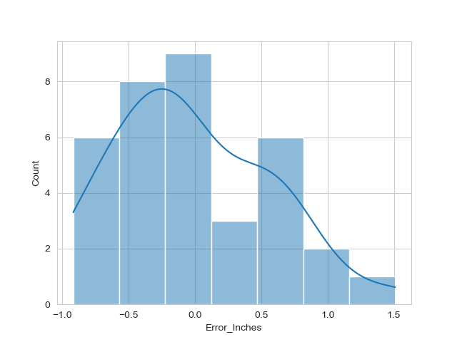
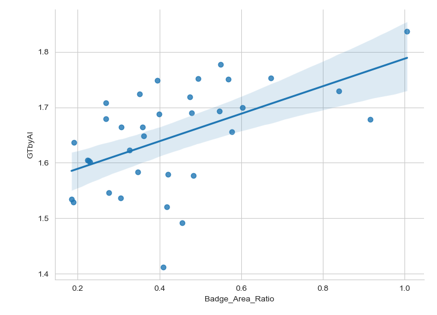

# Utility Pole AI Photogrammetry

> Computer-vision pipeline for **non-contact measurement** of utility pole geometry:
> width/diameter from video and tilt angle from field images.

[](https://python.org)
[](https://pytorch.org)
[](LICENSE)

---

## Overview

Traditional utility pole inspection requires physical contact with specialised
calipers or laser rangefinders.  This project replaces those methods with an
AI photogrammetry pipeline that operates on standard smartphone video and field
photographs — no special hardware needed.

Two independent measurement capabilities are implemented:

| Capability | Input | Output |
|---|---|---|
| **Pole width / diameter** | Walking video (smartphone) | Diameter in inches & mm, per-frame annotated video |
| **Pole tilt angle** | Single field photograph | Tilt in degrees from vertical, annotated image + methodology figure |

---

## System Architecture

```mermaid
flowchart TD
    subgraph Width Estimation
        V[Video / Image] --> YW1[YOLO-World\nDetection\nPOLE + BADGE]
        YW1 --> SAM1[EfficientSAM\nInstance Segmentation]
        SAM1 --> DM[Pole mask at\nbadge midpoint]
        DM --> SC[Depth-calibrated\nscaling\n× 1.32]
        SC --> OUT1[Diameter\n± 0.47 in MAE]
    end

    subgraph Tilt Estimation
        I[Field Image] --> YW2[YOLO-World\nDetection\nPOLE]
        YW2 --> SAM2[EfficientSAM\nInstance Segmentation]
        SAM2 --> MA[Medial-axis\ntransform]
        MA --> HT[Hough Line\nTransform]
        HT --> OUT2[Tilt angle\ndegrees from vertical]
    end
```



---

## Pole Width / Diameter Estimation

### Algorithm

1. **Reference-object detection** — YOLO-World (`yolov8x-world.pt`) detects
   two classes simultaneously: `POLE` and `BADGE` (a 1.25-inch inspection
   badge affixed by the operator before filming).

2. **False-positive pruning** — heuristic filters ensure the pole detection is
   plausible: height-to-width ratio, area bounds (4 %–75 % of frame), badge
   must be spatially contained within pole bounds.

3. **Instance segmentation** — EfficientSAM produces a pixel-accurate mask for
   the pole.  The mask is sliced at the vertical midpoint of the badge
   bounding box to measure the true cross-sectional width at a known depth.

4. **Depth-calibrated scaling** — a fixed scaling factor of `1.32` converts the
   pixel ratio (pole width / badge width) to real-world inches:
   ```
   diameter_inches = 1.32 × (pole_pixels / badge_pixels)
   ```
   The factor was determined by linear regression on a 35-image calibration
   set (see `results/width_estimation/analysis/`).

5. **Per-video aggregation** — diameter estimates from all frames are collected
   and the median is reported as the final estimate.

### Performance — 35-image validation set (9–16 inch poles)

| Metric | Value |
|--------|-------|
| Mean Absolute Error (MAE) | **0.47 in (12.0 mm)** |
| RMSE | 0.57 in (14.6 mm) |
| Best single-frame error | 0.022 in (0.56 mm) |
| Worst single-frame error | 1.51 in (38.4 mm) — 9.3″ pole |
| Diameter range tested | 9.0 – 16.0 inches |

> **Note:** Accuracy decreases slightly for smaller poles (≤ 10 in) because the
> badge occupies a larger fraction of the frame, making the depth-scaling
> assumption less accurate.

### Sample results



*Distribution of per-frame diameter errors across 35 validation images.*



*Correlation between badge-area ratio and depth-scaling factor used for calibration.*

Annotated result videos are in `results/width_estimation/`:
- `pole_width_result_01.mp4` — 11.3-inch pole
- `pole_width_result_02.mp4` — 9.5-inch pole

### Usage

```bash
# Single video (ground-truth diameter optional, enables error overlay)
poetry run python src/main.py -i data/sample/sample_1.mp4 -d 9.5

# Default sample (no ground truth)
poetry run python src/main.py
```

---

## Pole Tilt Angle Estimation

### Algorithm

1. **Pole detection** — same YOLO-World model, pole-only classes.

2. **Segmentation** — EfficientSAM produces a binary mask of the pole body.

3. **Medial-axis transform** — `skimage.morphology.medial_axis` thins the mask
   to a single-pixel skeleton representing the pole centreline.

4. **Hough line transform** — `skimage.transform.hough_line` finds the dominant
   straight-line orientations in the skeleton.  The median angle of the top-5
   Hough peaks is taken as the pole axis direction.

5. **Tilt from vertical** — in the Hough parameterisation, the `theta` of the
   line normal equals the deviation of the line from vertical.  A perfectly
   upright pole gives `theta = 0`; positive angles lean right, negative left.

### Output per image

| File | Description |
|------|-------------|
| `<name>_tilt.jpg` | Clean annotated image: bounding box, SAM mask overlay, angle arc with degree label |
| `<name>_analysis.jpg` | 4-panel methodology figure: input → mask → skeleton → Hough candidates |

Sample tilt result:


### Usage

```bash
# Single image
poetry run python src/tilt.py -i data/sample/pole_tilt/leaning_pole_01.jpg \
                               -o result/pole_tilt/leaning_pole_01_tilt.jpg

# Batch — process a whole folder and write a CSV summary
python - <<'EOF'
import sys; sys.path.insert(0, "src")
from AI import AI
from tilt import run_tilt_batch

ai = AI()
run_tilt_batch(
    input_dir  = "data/sample/pole_tilt/",
    output_dir = "result/pole_tilt/",
    ai         = ai,
    results_csv = "result/pole_tilt/tilt_summary.csv",
)
EOF
```

---

## Repository Structure

```
├── src/
│   ├── AI.py            # YOLO-World + EfficientSAM model wrapper
│   ├── diameter.py      # Width/diameter estimation class
│   ├── tilt.py          # Tilt angle estimation class + batch runner
│   ├── video.py         # Frame extraction / video reconstruction (ffmpeg)
│   ├── main.py          # CLI entry points (pole_diameter, pole_tilt)
│   └── vanishingpoint.py # Vanishing-point utility (perspective analysis)
│
├── data/
│   ├── sample/
│   │   ├── sample_1.mp4 … sample_3.mp4      # width estimation input videos
│   │   ├── manual_diameter.csv               # ground-truth diameters for samples
│   │   └── pole_tilt/                        # 27 leaning-pole field images
│   └── sample/pole_width/
│       ├── images/                           # 7 still images for diameter testing
│       └── ground_truth_diameter.csv
│
├── results/
│   ├── width_estimation/
│   │   ├── pole_width_result_01.mp4          # annotated output video
│   │   ├── pole_width_result_02.mp4
│   │   └── analysis/
│   │       ├── diameter_error_metrics.csv    # per-image errors
│   │       ├── AI_Dia_Error_MM_histogram.png
│   │       ├── Corr_Badge_Area_Ratio_and_Error.png
│   │       └── pole_diameter_badge_image_area_ratio_regression.png
│   └── tilt_estimation/                      # sample tilt result images
│
├── models/
│   └── README.md        # model download instructions
│
├── pyproject.toml       # Poetry project & dependency spec
└── requirements.txt     # pip alternative
```

---

## Setup

### Prerequisites

- Python 3.11+
- [Poetry](https://python-poetry.org/) (`pipx install poetry`)
- [ffmpeg](https://ffmpeg.org/) (`brew install ffmpeg` on macOS)

### Install

```bash
git clone https://github.com/ashish-code/utility-pole-ai-photogrammetry.git
cd utility-pole-ai-photogrammetry

# Install Python dependencies
poetry install

# Download model weights (see models/README.md for details)
wget "https://huggingface.co/spaces/SkalskiP/YOLO-World/resolve/main/efficient_sam_s_cpu.jit"
poetry run python -c "from ultralytics import YOLOWorld; YOLOWorld('yolov8x-world.pt')"
```

### Hardware

The pipeline runs on CPU (slower) or CUDA GPU (recommended).
`AI.py` selects the device automatically.

| Device | Frame throughput |
|--------|-----------------|
| NVIDIA RTX 3090 | ~3 frames/s |
| Apple M2 (CPU) | ~0.2 frames/s |

---

## Dependencies

| Library | Role |
|---------|------|
| `ultralytics` | YOLO-World detection |
| `torch` / `torchvision` | EfficientSAM inference |
| `supervision` | Detection parsing & annotation |
| `scikit-image` | Medial-axis transform, Hough lines |
| `opencv-python` | Image I/O, text overlay, video ops |
| `matplotlib` | Methodology figures |
| `pandas` | Batch results CSV |

---

## Background

This project was developed in collaboration with
[Osmose Utilities Services](https://www.osmose.com/) to explore non-contact AI
approaches to field inspection.  The badge-based photogrammetry method provides
a low-cost, scalable alternative to contact measurement for pole condition
surveys.

---

## License

MIT — see [LICENSE](LICENSE).
